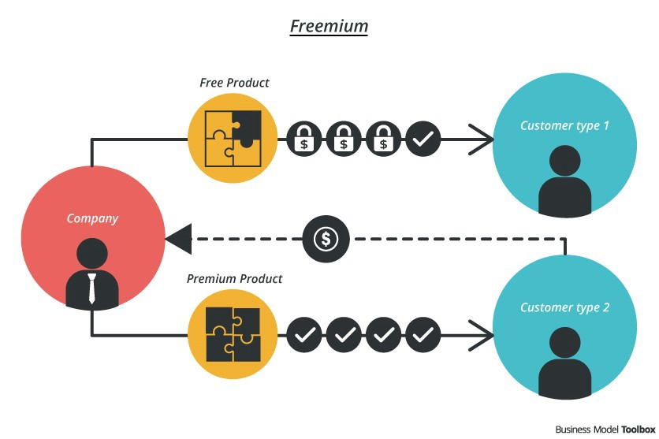

# Pay Models for Online News 
[Medium link](https://medium.com/journalism-trends-technologies/pay-models-for-online-news-8ea87d46a3c7#_ftn2)

"...the essential function of digital journalism is to adopt digital technologies while researching, producing and delivering news and information to media-literate communities.[6]"

Sustainability-related challenges that digital news faces:
- The economic structures of mainstream media mainly based on **austerity and advertising revenues are hardly applicable** to online news. Digital advertising is monopolised by major companies such as Facebook or Google[7].
- The largest part of news users is **unwilling to pay** for online news, regarding it as free content.
- Online competition for peoples’s attention has soared, including from **social media and citizen journalists** [8].
- Journalism is **not a viable model by itself**, requiring additional revenue sources next to reader fees.

> Traditional news outlet has to compete with social media and citizen journalists. How do they do that?

## Three models digital news generates income from its audiences

### Paywalls
*Hard paywalls* require users to pay for (almost) all the content (e.g., The Times)  
*Soft paywalls* let readers access a certain amount of content without paying and only invite them to buy a subscription once they want to read more articles beyond that amount [14]. (e.g., NYT)

### Subscriptions
= a way to extend the period of selling the product or the service and at the same time receiving a periodic payment from a subscriber [19]

### Freemium models
= a hybrid access model

