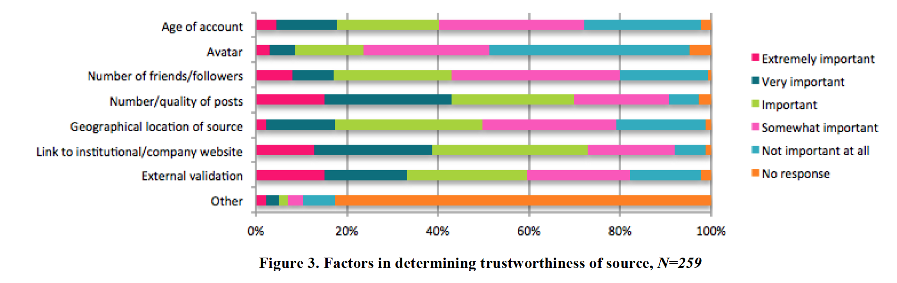

# NOTES=Sourcing and Trust: Twitter Journalism in Ireland

(2015)

**Abstract**:
"The analysis is built on a survey of journalists in Ireland conducted in 2013, which revealed that journalists in Ireland are heavy adopters of Twitter in their workflows, and in particular use social media for sourcing news leads and content. However, they are highly skeptical about the level of trust in social media. While this paper focuses on journalists in Ireland, the analysis of the relationship between trust, sourcing and verification reveals broader patterns about journalistic values, and how these values and practices operate in the new media landscape."

*source/news gathering process*

"Twitter facilitated greater inclusion of ‘nonelite’ voices during rapid and often confusing developments"

"Broersma and Graham [1] refer to social networks as ‘huge pools’ of ‘collective intelligence’ that allow reporters to obtain information about ongoing events, to diversify voices, and to get in touch with informative sources."

"Hermida [10] argues that the openness and instantaneity of Twitter has affected two key aspects of journalism as gatekeeping: **sourcing and verification**."

"This study is drawn from the results of a national survey of journalists working in Ireland, across all types of organisations, beats, and media. The survey was open to all journalists -- full-time, part-time, casual, and freelance -- but results are limited to those who identify as professional journalists, which the survey defines as those who state that journalism forms a ‘significant part’ of their income."

"The reluctance to use social media for verification has been discussed frequently at broadcaster debates and conferences [16]. A reason for this reluctance could be a consequence of the demands that are placed on a journalists’ time when **verifying social media content – the process is very time-consuming**– a factor that has been recently occupying discussions at broadcaster debates and conferences [16]."

> This article has a bunch of useful graphs outlining how journalists in Ireland use different media sources (how frequently they use them, how much they trust the different sources, how they determine trustworthiness, etc.)

"...social media is currently providing an additional or alternative platform for accessing sources, rather than providing new root sources of information..."

"The lack of social connectivity to unknown sources is perhaps not surprising in that familiarity with a source leads to a level of trust; Hermida, Lewis and Zamith argue that “the more familiar journalists are with a source, the more likely they are to be considered credible” [11]."

"When social media content is deemed worthy of further inquiry, journalists pursue a number of methods for validating information. The most popular method adopts the long-standing practice of direct contact with trusted individuals. Eighty-three percent of respondents state that, in order to validate content on social media, they contact official bodies, such as press offices or the police."

