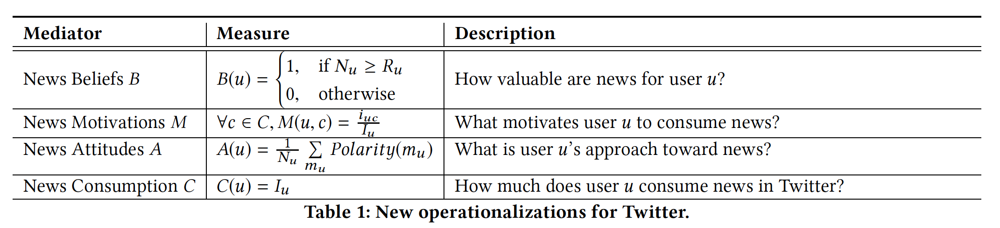

# Modeling and Predicting News Consumption on Twitter
(2018)

### Abstract
- revealing what drives users to consume news
- developing a news consumption prediction model: "Twitter News Model (TNM)"

Our findings reveal that **news motivations**, followed by **news attitudes** and **news beliefs**, impact users’ behavior of news consumption on Twitter.

### "Twitter News Model (TNM)"
analyzing their **interactions with journalists and news-tweets**  
--> reveal what drives users to consume news
--> predictively relate users’ news beliefs, motivations, and attitudes to their consumption of news

### Related works
- Perception of news
- Users' engagement with news
- Trust in news providers
- News sharing
- News consumption

### Modeing news consumption

**Based on the** **_Motivational Consumption Model_**
- **News beliefs**: refer to the value that news has for people, that news can be conceived to be a means to empower and mobilize the public. These news beliefs were operationalized by 7-point Likert scale ratings of survey questions that asked participants (i) how important the news is to you, and (ii) whether being informed was empowering.

- **News motivations**: refer to the reasons driving people’s consumption of news. For instance, some people consume news because it helps them keep up with current events that are topics of conversations in their social circle or it allows them to make informed decisions in their daily life; whereas others consume news as a source of entertainment. These news motivations were operationalized by combining ratings from five survey questions that asked participants whether they consumed news (i) to find out what is going on in the world, (ii) to keep up with the way your government functions, (iii) to make yourself an informed citizen, (iv) to gain important new information, and (v) to fulfill your need to know.

- **News attitudes**: reflect positive views of the news, that see news consumption as an enjoyable and advantageous behavior. These news attitudes were operationalized by survey questions that asked participants if they agreed with the following statements: (i) getting the news is enjoyable to you, and (ii) getting the news is advantageous to you.

### Realizing the model
#### Dataset
We collected all tweets posted by 200 manually curated Irish media sources and journalists accounts covering 79 different
news outlets.2 The accounts were selected to cover all major national and regional media outlets for Ireland, in addition to individual journalists writing for these outlets.  
The data collection spans a period of **four months** from August 10th to December 10th, 2017.
#### Measuring the three factors^ in the dataset
#### Predict and explain
- explore three different regression models, namely Random Forest (RF) [11], Gradient Boosting Trees (GBT) [11], and Extremely Randomized Trees (ET) [10]
- compared three ways to model users
    - Twitter News Model
    - Word-embeddings
    - Twitter News Model+Word-embeddings
- Interpretability vs. predictive power

### Discussion
- We found that the most telling features in the prediction of users’ news consumption are news motivations, or the reasons that drive them to consume news. (second most telling is news attitudes, and lastly news beliefs)
- The features reflecting news beliefs appeared to have the least
importance in the prediction of news consumption.
- Twitter News Model helps make the results most interpretable, but it is the poorest prediction model.
